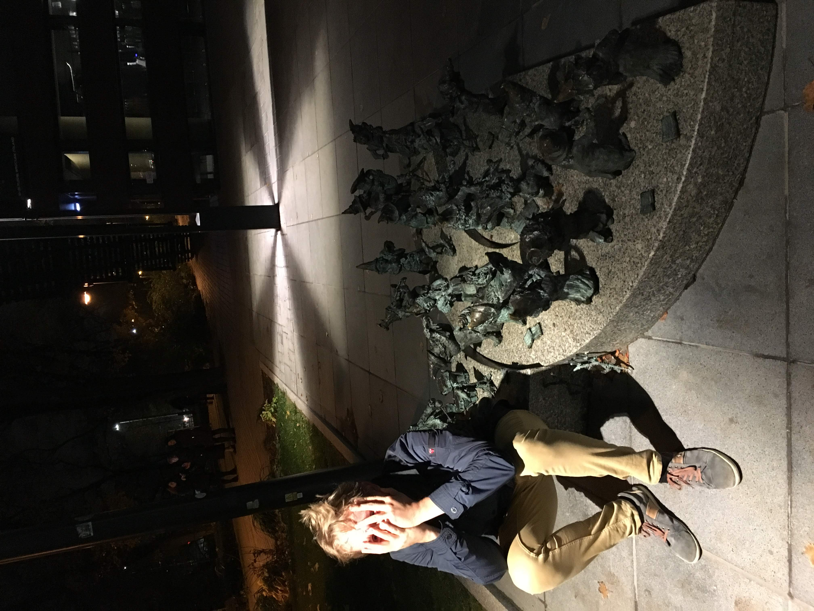

# The Dwarves of Wroclav

__Map of the dwarves statues in Wroslaw (Poland)__

The GPS coordinates of the statues can be found in the polish Wikipedia page of 
the city. I took the opportunity to turn them into a small exercise of 
web-scraping and interactive maps (with Folium).

__Introduction__

Have you ever been to Wroclav? It's a cute little University city on the Oder river in western Poland. It is famous for being the historical capital of Silesia and for the Centennial Hall, the Unesco World Heritage Site designed by Max Berg in 1911 - 1913. However, in my opinion one of the most interesting quality of the city is that among many striking architectural curiosity, musea and beautiful historical neigborhoods it hides 350 statues of little dwarves, commemorating a shop or a building or just hanging out at some street corner. 

I went there in November 2018 with a companion and of course Dwarf-spotting quickly became our main activity. The person to spot the most dwarves would win a pizza with beer from the best pizza place in Munich. Obviously I won, with a crushing 144 dwarves-sightings vs. the 96 of my companion. I think the full experience can be summarized by this picture:

However, we were never able to find a satisfying map of the little dwarves. Thus, when we came home I decided to code one using Folium and the GPS coordinates found on Polish Wikipedia. Use it wisely!

